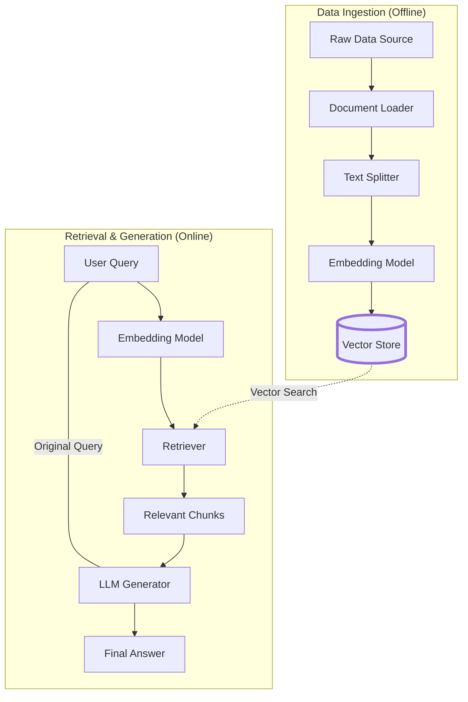
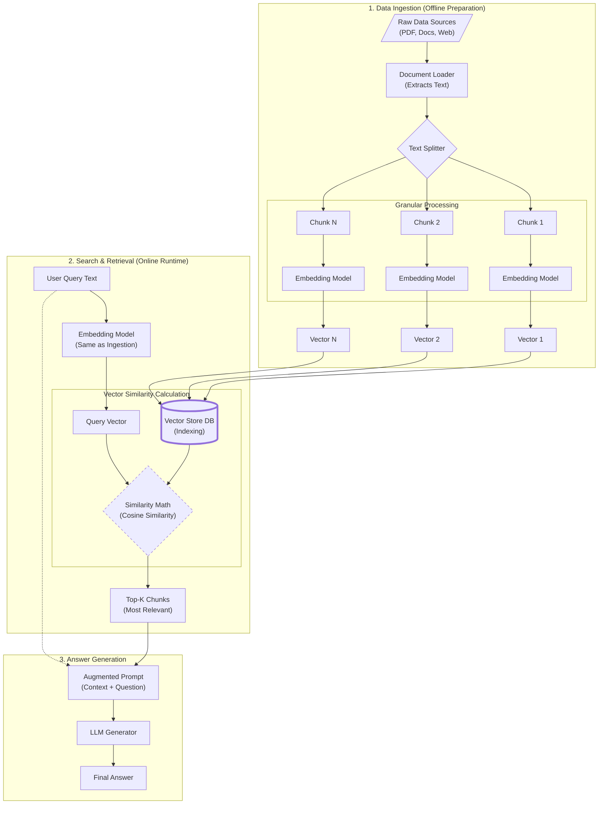
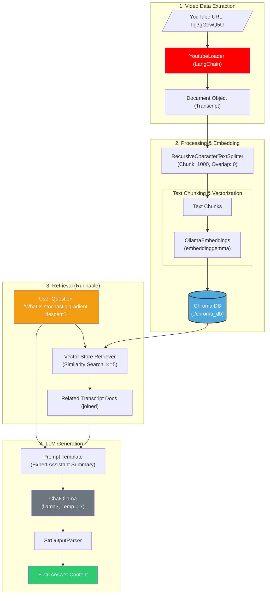

# RAG
Rag is a way to make model smarter by giving it extra information at the time you ask your question.

## Simple Architecture Diagram


## Detailed Architecture 


## Structure for making youtube summarizer chatbot




```python
from langchain_community.document_loaders import YoutubeLoader
from langchain_text_splitters import RecursiveCharacterTextSplitter
from langchain_ollama.embeddings import OllamaEmbeddings
from langchain_core.prompts import PromptTemplate
from langchain_chroma import Chroma
from langchain_core.output_parsers import StrOutputParser
from langchain_ollama.chat_models import ChatOllama as Ollama
from random import randint

# Initialize the embedding model
embedding_model= OllamaEmbeddings(model="embeddinggemma")

# Initialize the YouTube loader with the desired URL
loader = YoutubeLoader.from_youtube_url("https://www.youtube.com/watch?v=Ilg3gGewQ5U")

# Initialize the text splitter
splitted_text = RecursiveCharacterTextSplitter(
    chunk_size=1000,
    chunk_overlap=0
)

# Initialize the vector store
vector_store = Chroma(
    collection_name=f"youtube_embeddings_{randint(0,10000)}",
    embedding_function=embedding_model,
    persist_directory="./chroma_db"
)


#initialize the LLM
llm= Ollama(model="llama3", temperature=0.7)


# Initialize Prompt Template
prompt_template= PromptTemplate(
    template="""
You are an expert assistant that helps to summarize YouTube videos.

user Question:
{question}

Given the following extracted parts of a YouTube video transcript, 
Transcript:
{transcript}

Please answer the question asked by user based on the transcript above.
""",
input_variables=["question", "transcript"]
)


# Initialize Structured Output Parser
output_parser= StrOutputParser()

# create a runnable retriever chain
vector_store_runnable= vector_store.as_retriever(
    kwargs={
        "search_kwargs": {"k": 5}
    },
    search_type="similarity"
)

question = "WHat is stochastic gradient descants."

# Load Documents from YouTube
documents = loader.load()

# Split Documents into Chunks
chunk = splitted_text.split_documents(documents)

# Add Chunks to Vector Store
vector_store.add_documents(chunk)

# Load Related Documents
related_docs = "".join([content.page_content for content in vector_store_runnable.invoke(question)])


# Invoke the prompt with the related documents
prompt = prompt_template.invoke(
    input={
        "question": question,
        "transcript": related_docs
    }
)

# Send to llm
response = llm.invoke(prompt)

print("Summary of the YouTube Video:")
print(response.content)
```

using chains:
```python
from langchain_community.document_loaders import YoutubeLoader
from langchain_text_splitters import RecursiveCharacterTextSplitter
from langchain_ollama.embeddings import OllamaEmbeddings
from langchain_core.prompts import PromptTemplate
from langchain_chroma import Chroma
from langchain_core.output_parsers import StrOutputParser
from langchain_ollama.chat_models import ChatOllama as Ollama
from langchain_core.runnables import RunnableParallel, RunnableSequence, RunnableLambda,RunnablePassthrough
from random import randint

# Initialize the embedding model
embedding_model= OllamaEmbeddings(model="embeddinggemma")

# Initialize the YouTube loader with the desired URL
loader = YoutubeLoader.from_youtube_url("https://www.youtube.com/watch?v=Ilg3gGewQ5U")

# Initialize the text splitter
splitted_text = RecursiveCharacterTextSplitter(
    chunk_size=1000,
    chunk_overlap=0
)

# Initialize the vector store
vector_store = Chroma(
    collection_name=f"youtube_embeddings_{randint(0,10000)}",
    embedding_function=embedding_model,
    persist_directory="./chroma_db"
)


#initialize the LLM
llm= Ollama(model="llama3", temperature=0.7)


# Initialize Prompt Template
prompt_template= PromptTemplate(
    template="""
You are an expert assistant that helps to summarize YouTube videos.

user Question:
{question}

Given the following extracted parts of a YouTube video transcript, 
Transcript:
{transcript}

Please answer the question asked by user based on the transcript above.
""",
input_variables=["question", "transcript"]
)


# Initialize Structured Output Parser
output_parser= StrOutputParser()

# create a runnable retriever chain
vector_store_runnable= vector_store.as_retriever(
    kwargs={
        "search_kwargs": {"k": 5}
    },
    search_type="similarity"
)

question = "WHat is stochastic gradient descants."

# Load Documents from YouTube
documents = loader.load()

# Split Documents into Chunks
chunk = splitted_text.split_documents(documents)

# Add Chunks to Vector Store
vector_store.add_documents(chunk)

# Load Related Documents
related_docs = "".join([content.page_content for content in vector_store_runnable.invoke(question)])


# Invoke the prompt with the related documents
prompt = prompt_template.invoke(
    input={
        "question": question,
        "transcript": related_docs
    }
)

parallel_runnable = RunnableParallel({
    "question": RunnablePassthrough(),
    "transcript": vector_store_runnable | RunnableLambda(lambda x: "".join([content.page_content for content in x]))
}
)

# Create a sequence runnable to chain the prompt and llm
sequence_runnable = parallel_runnable | prompt_template | llm | output_parser

# Invoke the sequence runnable with the question
response = sequence_runnable.invoke(question)

print("Response:", response)
```