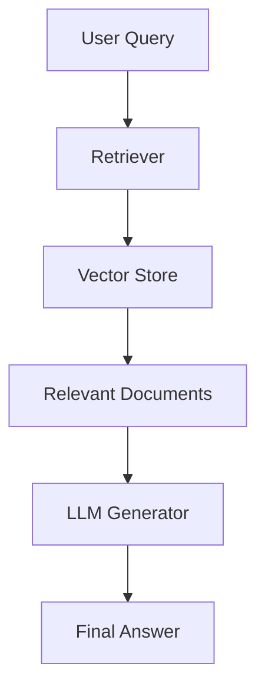

---
---

# RAG
Rag is a way to make model smarter by giving it extra information at the time you ask your question.

Architecture of RAG:

```mermaid
graph TD
    A[User Query] --> B[Retriever]
    B --> C[Vector Store]
    C --> D[Relevant Documents]
    D --> E[LLM Generator]
    E --> F[Final Answer]

```