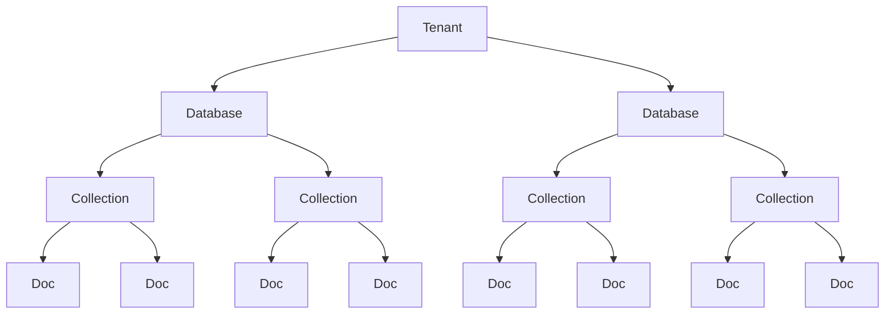

# Vector Store

## Concept of Embedding

Embeddings are numerical representations of text that capture semantic meaning. An embedding model converts text into its corresponding vector representation, allowing us to compare different texts by their vector representations using distance metrics like cosine similarity or Euclidean distance.

### Example: Movie Recommendation System

Consider a movie recommendation system with story plots for movies m1, m2, m3, m4, and m5. We convert each movie plot into an embedding vector using an embedding model. Similar movies will have similar embedding vectors as shown below:


When a user watching movie m4 wants recommendations for similar movies, we use cosine similarity to find the nearest embedding vectors to m4's embedding vector and recommend those movies.


## Why Vector Store?

Traditional databases like MySQL or PostgreSQL cannot efficiently calculate cosine similarity or Euclidean distance on text data. Vector stores are specifically designed to handle high-dimensional vector data and perform similarity searches efficiently. Additionally, semantic search is not possible in traditional databases.

## Key Features of Vector Stores

- **Storage**: Efficiently store vectors and their metadata in disk or memory
- **Semantic Search**: Retrieve vectors most similar to a query vector
- **Indexing**: Provide data structures or methods that enable fast search on high-dimensional vector data (e.g., approximate nearest neighbor search)
- **CRUD Operations**: Add, update, delete, and retrieve vectors

## Use Cases of Vector Stores

- Semantic Search
- Recommendation Systems
- RAG (Retrieval-Augmented Generation)
- Image/Multimedia Search

## Vector store and Vector Database

**Vector Store**: Typically refers to a lightweight library or service that focuses on storing vectors
(embeddings) and performing similarity search.

May not include many traditional database features like transactions, rich query
languages, or role-based access control.

Ideal for prototyping, smaller-scale applications
Examples: FAISS (where you store vectors and can query them by similarity, but you
handle persistence and scaling separately)

**Vector Database**:
A full-fledged database system designed to store and query vectors.
Offers additional “database-like” features:
▪ Distributed architecture for horizontal scaling
▪ Durability and persistence (replication, backup/restore)
▪ Metadata handling (schemas, filters)
▪ Potential for ACID or near-ACID guarantees
▪ Authentication/authorization and more advanced security
○ Geared for production environments with significant scaling, large datasets
○ Examples: Milvus, Qdrant, Weaviate.

> **Note**: A vector database is effectively a vector store with extra database features (clustering, scaling, security, metadata filtering, and durability)


## Vector Store in LangChain

LangChain provides a unified interface to work with various vector stores and vector databases through its `VectorStore` module. This allows developers to easily switch between different vector storage solutions without changing their application logic.

### Popular Vector Stores Supported by LangChain

- FAISS
- Pinecone
- Weaviate
- Milvus
- Chroma

You can use methods like `from_documents()`, `from_texts()`, `add_documents()`, and `add_texts()` to create vector stores from documents, and `similarity_search()` to perform semantic search on any of the above vector stores without changing any code.
 
## Chroma Vector Store

Chroma is a lightweight, open-source vector database that is especially friendly for local development and small- to medium-scale production needs.

### Installation

```bash
pip install chromadb
```

### Chroma Hierarchy



**Hierarchy Components**:
- **Tenant**: Top-level entity representing an isolated environment for a user or organization
- **Database**: A logical grouping of collections within a tenant
- **Collection**: A grouping of related documents within a database
- **Document**: Individual data entries stored within a collection, each associated with an embedding vector and metadata

### Basic Operations

#### Initialize Chroma Vector Store

```python
from chromadb import Chroma

vector_store = Chroma(
    embedding_function=embedding_model,  # Your embedding model
    persist_directory="path/to/persist/directory",  # Optional: Directory to persist the database
    collection_name="my_collection"  # Optional: Name of the collection to use
)
```

This initializes a Chroma vector store with a specified embedding model, optional persistence directory, and optional collection name.

#### Add Documents to Chroma

```python
vector_store.add_documents(documents)  # documents is a list of Document objects
```

This adds Document objects to the Chroma vector store, where each document is converted into its embedding vector using the specified embedding model before storage.

#### Retrieve Embeddings, Documents, and Metadata

```python
vector_store.get(
    'embeddings',
    'documents',
    'metadatas'
)
```

This retrieves embeddings, documents, and metadata from the Chroma vector store.

#### Similarity Search

```python
results = vector_store.similarity_search(
    query_text,  # The text query to search for
    k=5  # Number of similar documents to retrieve
)
```

This performs a similarity search in the Chroma vector store using a text query and retrieves the top 5 documents most similar to the query based on their embedding vectors.

#### Similarity Search with Scores

```python
results_with_scores = vector_store.similarity_search_with_score(
    query_text,  # The text query to search for
    k=5  # Number of similar documents to retrieve
)
```

This performs a similarity search and retrieves the top 5 documents along with their similarity scores. The method first converts the query text to an embedding vector using the embedding model, then compares it with stored vectors to find the most similar documents.

#### Filtering Based on Metadata

```python
results = vector_store.similarity_search(
    query_text,  # The text query to search for
    k=5,  # Number of similar documents to retrieve
    filter={"source": "example.txt"}  # Metadata filter
)
```

#### Delete Operations

##### Delete Documents by Metadata Filter

```python
vector_store.delete(
    filter={"source": "example.txt"}  # Metadata filter
)
```

##### Delete All Documents

```python
vector_store.delete()
```

##### Delete Specific Documents by IDs

```python
vector_store.delete(
    ids=["doc_id_1", "doc_id_2"]  # List of document IDs to delete
)
```

#### Update Documents

```python
from langchain_core.documents import Document

updated_document = Document(
    page_content="Updated content of the document.",
    metadata={"source": "example.txt", "page": 1}
)
vector_store.update_documents(document_id="doc_id", document=updated_document)
```

