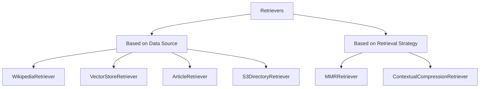

# Retrievers in LangChain

Retrievers are components in LangChain that facilitate efficient retrieval of relevant documents from a vector store based on a given query. There are several types of retrievers available in LangChain, each designed for specific use cases and retrieval strategies.

> **Note:** All retrievers are runnable.

---

## Types of Retrievers

Retrievers can be divided into two main categories:

### 1. Based on Data Source
- **WikipediaRetriever**: Retrieves the relevant sections from Wikipedia articles.
- **VectorStoreRetriever**: Retrieves documents from a vector store based on similarity to the query.
- **ArticleRetriever**: Retrieves articles from various sources based on the query.
- **S3DirectoryRetriever**: Retrieves documents stored in an S3 bucket.

### 2. Based on Retrieval Strategy
- **MMRRetriever**: Implements Maximal Marginal Relevance to diversify the retrieved documents.
- **MultiQueryRetriever**: Uses multiple queries to retrieve a broader set of relevant documents.
- **ContextualCompressionRetriever**: Compresses the context of documents before retrieval to improve efficiency.

---

## Hierarchical Diagram of Retrievers in LangChain



---

## WikipediaRetriever

A Wikipedia retriever fetches relevant sections from Wikipedia articles based on a given query. It uses the Wikipedia API to search for articles and extract relevant content.

### How It Works:
1. Takes a query as input.
2. Sends the query to the Wikipedia API.
3. Retrieves the most relevant articles.
4. Returns them as LangChain documents.

```python
from langchain_community.retrievers import WikipediaRetriever

retriever = WikipediaRetriever(
    top_k_results=5,  # Number of top relevant articles to retrieve
    lang="en"  # Language of the Wikipedia articles
)
result = retriever.invoke("What is LangChain?")  # Retrieve relevant Wikipedia sections

for doc in result:
    print(doc.page_content)  # Print the content of each retrieved document
```

---

## Vector Store Retriever

A Vector Store Retriever fetches documents from a vector store based on their similarity to a given query. It uses vector embeddings to represent both the query and the documents, allowing for efficient similarity search.

### How It Works:
1. Takes a query as input.
2. Converts the query into a vector embedding.
3. Searches the vector store for documents with similar embeddings.
4. Returns the most similar documents as LangChain documents.

```python
vector_store_retriever = vector_store.as_retriever(
    search_kwargs={"k": 5}  # Number of top similar documents to retrieve
)
vector_store_retriever.invoke("Explain the concept of embeddings in NLP.")
```

> **Note:** The vector store must be initialized and populated with documents before using the Vector Store Retriever.

### Example:
```python
from langchain_chroma import Chroma
from langchain_ollama.embeddings import OllamaEmbeddings
from langchain_community.document_loaders import PyPDFLoader
from langchain_text_splitters import RecursiveCharacterTextSplitter

# Load document
loader = PyPDFLoader("docs/1.pdf")
pages = loader.lazy_load()

# Split based on text
chunking = RecursiveCharacterTextSplitter(
    chunk_size=1000,
    chunk_overlap=0,
)
chunk = chunking.split_documents(pages)

# Initialize embedding model
embedding_model = OllamaEmbeddings(model="embeddinggemma")

# Initialize vector database
vector_db = Chroma(
    embedding_function=embedding_model,
    collection_name="cryptography_notes",
    persist_directory="notes"
)

# Store the documents in the vector database
vector_db.add_documents(documents=chunk)

# Get a retrievable object
retriever = vector_db.as_retriever(kwargs={
    "search_kwargs": {"k": 3}
})

# Test retrieval
docs = retriever.invoke("What is Cryptography?")
for doc in docs:
    print(doc.page_content)
```

### Why Use Vector Store Retriever?
Using a retriever allows you to switch between different retrieval strategies (e.g., MMR, MultiQuery) without changing the vector store code. Additionally, retrievers have a consistent interface, making it easy to integrate with other LangChain components to form complex pipelines.

---

## MMR (Maximal Marginal Relevance) Retriever

MMR Retriever implements the Maximal Marginal Relevance algorithm to diversify the retrieved documents. It balances relevance and diversity by selecting documents that are not only relevant to the query but also different from each other.

### Example:
Consider we have the following documents in our vector store:
- D1: "Climate change is causing glaciers to melt rapidly in the Arctic region."
- D2: "Glaciers in the Arctic are melting due to rising global temperatures."
- D3: "Sea levels are rising as a result of melting glaciers and ice caps."
- D4: "The economic impact of climate change is significant, affecting various industries worldwide."
For the query **"Effect of climate change on glaciers"**, a simple similarity search may return:
- D1: "Climate change is causing glaciers to melt rapidly in the Arctic region."
- D2: "Glaciers in the Arctic are melting due to rising global temperatures."
- D3: "Sea levels are rising as a result of melting glaciers and ice caps."

However, D1 and D2 are very similar. MMR Retriever may return:
- D1, D3, and D4: "The economic impact of climate change is significant, affecting various industries worldwide."

### How It Works:
1. Picks the most relevant document first.
2. Selects the next most relevant document that is least similar to the already selected documents.
3. Repeats until the desired number of documents is selected.

```python
vector_store_retriever = vector_store.as_retriever(
    search_type="mmr",
    search_kwargs={"k": 5, "lambda_mult": 0.5}
)
```
- k = number of documents to retrieve
- lambda_mult = trade-off parameter between relevance and diversity (0 = only diversity, 1 = only relevance)
> Note: if lambda_mult=1, MMR behaves like a standard similarity search.

example:
```python
from langchain_chroma import Chroma
from langchain_ollama.embeddings import OllamaEmbeddings

# Inititalize embedding model
embedding_model = OllamaEmbeddings(model="embeddinggemma")


#Initialize vector database
vector_db = Chroma(
    embedding_function=embedding_model,
    collection_name="crypography_notes",
    persist_directory="notes"
)


#Get a retriable object
retriever = vector_db.as_retriever(
search_type="mmr",
search_kwargs={"k": 2,"lambda_mult": 1}
)

#Test retrieval
docs = retriever.invoke("What is Cryptography?")
for doc in docs:
    print(doc.page_content)
    print("-----")
```


# Conceptual Compression Retriever
The Contextual Compression Retriever in LangChain is an advanced retriever that improves
retrieval quality by compressing documents after retrieval — keeping only the relevant
content based on the user's query.

### Problem:
Traditional retrievers return entire paragraphs, which may include irrelevant content. For example:
- Retrieved: "The Grand Canyon is a famous natural site. Photosynthesis is how plants convert light into energy. Many tourists visit every year."
- Relevant: "Photosynthesis is how plants convert light into energy."

### How It Works:
1. **Base Retriever** retrieves *N* documents.
2. A **compressor** (usually an LLM) processes each document.
3. The compressor keeps only the parts relevant to the query.

```python
from langchain_chroma import Chroma
from langchain_ollama.embeddings import OllamaEmbeddings
from langchain_classic.retrievers import ContextualCompressionRetriever
from langchain_ollama.chat_models import ChatOllama
from langchain_classic.retrievers.document_compressors import LLMChainExtractor

# Initialize embedding model
embedding_model = OllamaEmbeddings(model="embeddinggemma")

# Initialize chat model
chat_model = ChatOllama(model="llama3")

# Compressor
compressor = LLMChainExtractor.from_llm(chat_model)

# Initialize vector database
vector_db = Chroma(
    embedding_function=embedding_model,
    collection_name="cryptography_notes",
    persist_directory="notes"
)

# Get a retrievable object
retriever = vector_db.as_retriever(
    search_type="mmr",
    search_kwargs={"k": 2, "lambda_mult": 1}
)

# Add compression to retriever
compress = ContextualCompressionRetriever(
    base_retriever=retriever,
    base_compressor=compressor
)

# Test retrieval
docs = compress.invoke("Cryptography?")
for doc in docs:
    print(doc.page_content)
    print("-----")
```

### Architectural Diagram:
```mermaid
graph TD
    A[User Query] --> B[Base Retriever]
    B --> C[Retrieved Documents]
    C --> D1[Document 1]
    C --> D2[Document 2]
    C --> D3[Document 3]
    D1 --> E1[Compressor (LLM) - Compress Document 1]
    D2 --> E2[Compressor (LLM) - Compress Document 2]
    D3 --> E3[Compressor (LLM) - Compress Document 3]
    E1 --> F1[Compressed Content 1]
    E2 --> F2[Compressed Content 2]
    E3 --> F3[Compressed Content 3]
    F1 --> G[Return Compressed Documents to User]
    F2 --> G
    F3 --> G
```
